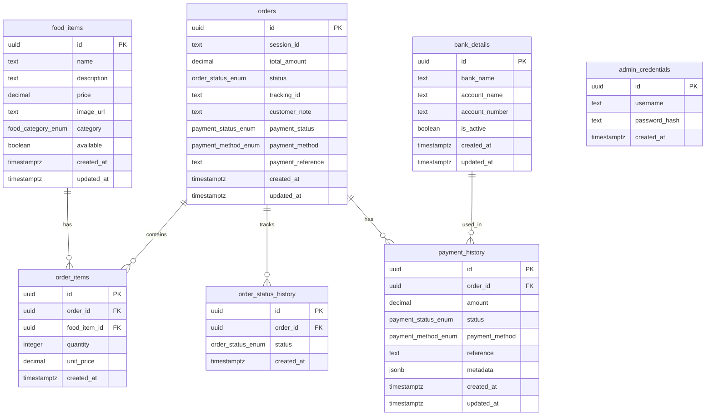

```mermaid
erDiagram
    food_items ||--o{ order_items : "has"
    orders ||--o{ order_items : "contains"
    orders ||--o{ order_status_history : "tracks"
    orders ||--o{ payment_history : "has"
    bank_details ||--o{ payment_history : "used_in"

    food_items {
        uuid id PK
        text name
        text description
        decimal price
        text image_url
        food_category_enum category
        boolean available
        timestamptz created_at
        timestamptz updated_at
    }

    orders {
        uuid id PK
        text session_id
        decimal total_amount
        order_status_enum status
        text tracking_id
        text customer_note
        payment_status_enum payment_status
        payment_method_enum payment_method
        text payment_reference
        timestamptz created_at
        timestamptz updated_at
    }

    order_items {
        uuid id PK
        uuid order_id FK
        uuid food_item_id FK
        integer quantity
        decimal unit_price
        timestamptz created_at
    }

    order_status_history {
        uuid id PK
        uuid order_id FK
        order_status_enum status
        timestamptz created_at
    }

    payment_history {
        uuid id PK
        uuid order_id FK
        decimal amount
        payment_status_enum status
        payment_method_enum payment_method
        text reference
        jsonb metadata
        timestamptz created_at
        timestamptz updated_at
    }

    bank_details {
        uuid id PK
        text bank_name
        text account_name
        text account_number
        boolean is_active
        timestamptz created_at
        timestamptz updated_at
    }

    admin_credentials {
        uuid id PK
        text username
        text password_hash
        timestamptz created_at
    }
``` 